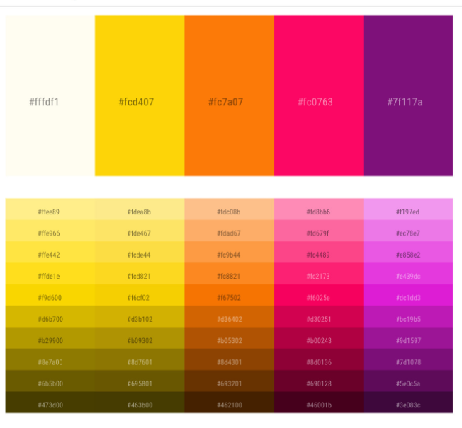
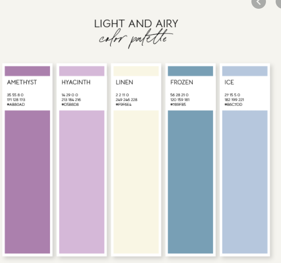
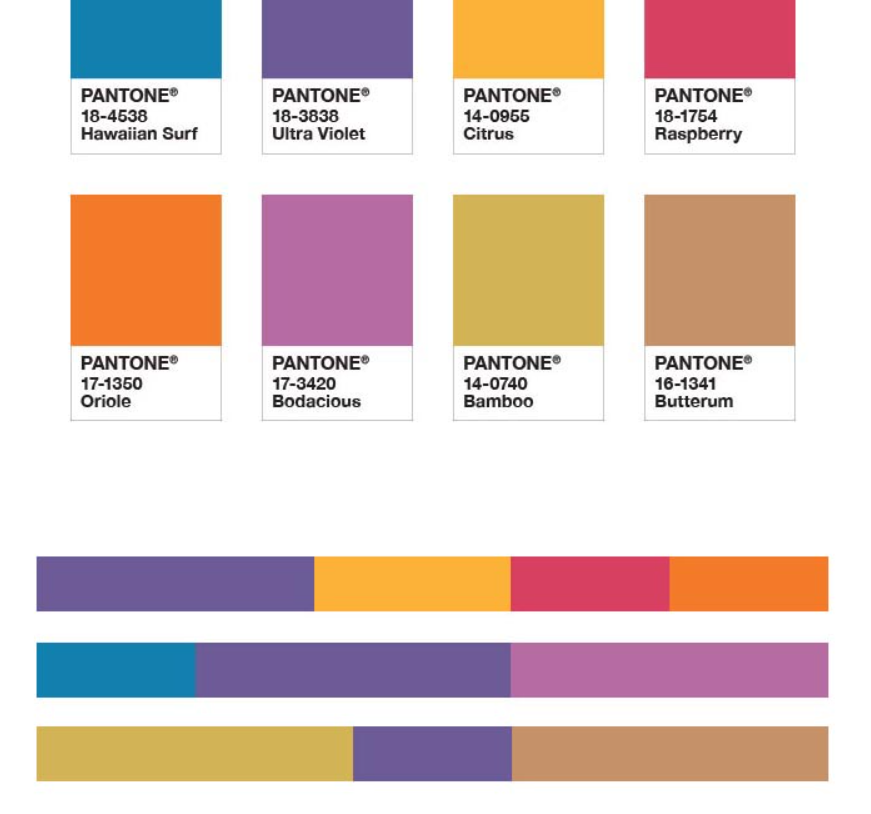
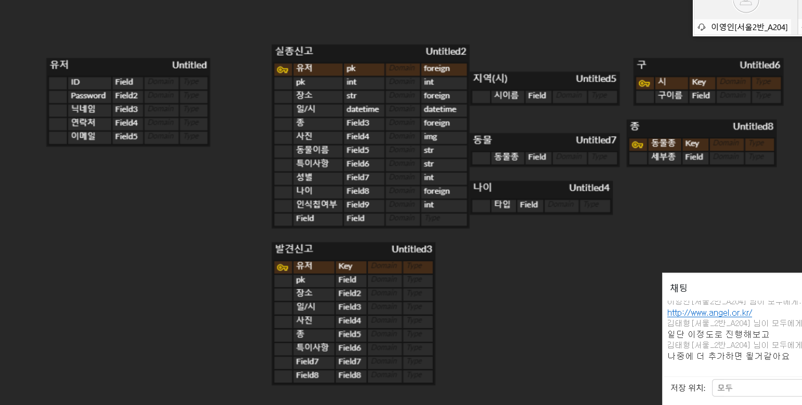

# 주제 회의

서비스 이름

후보: 찾았냥? 찾을개!, 찾을고양? 찾을개!, 고양으로 돌아와주개, dog안에 들었냥

팀명: 지금만나러갑니다,,, ☆

주제: 분실동물 찾아주는 서비스

서비스: 종 + 지역 + (강아지 경우 나이)

--------

동물 잃어버린 사람: 등록 -> 관련 정보

동물을 발견한 사람: 사진 등록 (지역까지 적기, 카톡아이디) -> 자동으로 올라감

회원가입 => 로그인

게시판 => 분실동물 등록 => (잃어버린사람 등록, 발견한 사람 등록)

​										   => 잃어버린 사람 게시글 => 데이터베이스 매칭 or 매칭실패시 등록

​																					  => 위급한 반려동물 => 우선순위

​										   => 발견한 사람 등록 => 데이터베이스 추가

​			=> 분실동물 조회 (완료표시)

​			=> 검색

​			=> 병원이나 유기견센터에 등록된 강아지

유기센터 => api 데이터 가져와서 목록 제공 [유기동물 api](https://www.data.go.kr/data/15001096/openapi.do)

시간이 남으면 정보제공, 정보공유

--------

프론트

대표 컬러 팔랫트: 파스텔톤 -> (재회의 의미 당귀꽃) 퍼플

폰트: 하은이가?









사안7: 촉촉한 초코칩

-------

백엔드

django

고양이 등록시 나이칸 X

실종신고 완료 여부 추가

발견신고 완료 여부 추가



-------

컨벤션

master -> develop

​              -> front -> feature/기능

​			  -> back -> feature/기능

​			-> release

커밋

* `git`

  * 기능(feat): 새로운 기능을 추가
  * 버그(fix): 버그 수정
  * 리팩토링(refactor): 코드 리팩토링
  * 형식(style): 코드 형식, 정렬, 주석 등의 변경(동작에 영향을 주는 코드 변경 없음)
  * 테스트(test): 테스트 추가, 테스트 리팩토링(제품 코드 수정 없음, 테스트 코드에 관련된 모든 변경에 해당)
  * 문서(docs): 문서 수정(제품 코드 수정 없음)
  * 기타(chore): 빌드 업무 수정, 패키지 매니저 설정 등 위에 해당되지 않는 모든 변경(제품 코드 수정 없음)

  ```bash
  # example
  # [ {{상태}} ] {{제목}}
  [Feat] 로그아웃 기능 추가 
  # {{변경사항}} : {{변경파일}}
  생성 : Logout.vue, ...
  수정 : UserTest.java, AccountController.java ...
  삭제 : LoginTest.java, ...
  ...
  ```

머지리퀘스트

브렌치이름

커밋 내용 복붙

뷰파일이름: 파스칼

프론트: 카멜

파이썬: 스네이크 (클래스이름: 파스칼)

프론트: 기술스택: Vue, Vuex, VueRouter, Bootstrap

백엔드: 기술스택: django, django rest framework

그외: MySQL, 텐서플로우(텐서보드), Docker

