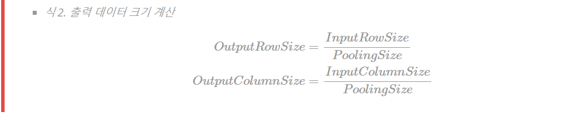

# 0907

> 1. CNN이란
> 2. 선형회귀(line regression)이란?

## 1. CNN이란

공간정보를 유지한 채로 러닝을 시도하기 위한 계산법

즉, rgb를 생각해보면 예전 방식은 r,g,b각 값을 억지로 한차원에 묶어서 배열에서 표현해줬어야하지만 지금 cnn방식을 이용하면 각각의 차원을 두고 계산이 가능하다

cnn 주요 용어들

> - Convolution(합성곱)
> - 채널(channel)
> - 필터(filter)
> - 커널( kernel)
> - 스트라이드(strid)
> - 패딩(padding)
> - 피처 맵(feature map)
> - 액티베이션 맵(activation map)
> - 풀링(pooling) 레이어

- 합성곱
  - 필터를 거쳐 계산을 진행하는 것
- 채널
  - 정보의 각 차원들
  - 이미지로 따지면 r채널g채널b채널이 있다
- 필터
  - 계산을 통해 새값을 도출하기 위한 필터
- 패딩
  - 일반적으로 합성곱을 진행하면 크기가 작아지는데 그것을 방지하기 위해 겉에다가 가상의 값을 넣어두는것
  - 일반적으로 0을 넣는다

### 레이어별 출력 데이터 산정

- Convolution 레이어 출력 데이터 크기 산정

  - 입력 데이터 높이: H

  - 입력 데이터 폭: W

  - 필터 높이: FH

  - 필터 폭: FW

  - Strid 크기: S

  - 패딩 사이즈: P

    > 

  - 위 식은 결과가 자연수가 되어야한다. 거기에 pooling사이즈의 배수여야한다. 이 조건을 만족하도록 Filter의 크기, Stride의 간격, pooling크기 및 패딩 크기를 조절해야한다

- Pooling 레이어 출력 데이터 크기 산정

  -  Pooling 사이즈를 Stride 같은 크기로 만들어서, 모든 요소가 한번씩 Pooling되도록 만듭니다. 입력 데이터의 행 크기와 열 크기는 Pooling 사이즈의 배수(나누어 떨어지는 수)여야 합니다. 결과적으로 Pooling 레이어의 출력 데이터의 크기는 행과 열의 크기를 Pooling 사이즈로 나눈 몫입니다. Pooling 크기가 (2, 2) 라면 출력 데이터 크기는 입력 데이터의 행과 열 크기를 2로 나눈 몫입니다. pooling 크기가 (3, 3)이라면 입력데이터의 행과 크기를 3으로 나눈 몫이 됩니다

    > 

- CNN 구성

  - 아래 그림은 전형적인 cnn이다. cnn은 반복적으로 스택을 쌓는 feature extraction 부분과 fully connected later를 구성하고 마지막 출력층에서는 softmax를 적용한다

    > 

  - ```python
    from keras.models import Sequential
    from keras.layers.convolutional import Conv2D
    from keras.layers.convolutional import MaxPooling2D
    from keras.layers import Dense
    from keras.layers import Flatten
    
    model = Sequential()
    model.add(Conv2D(12, kernel_size=(5, 5), activation='relu', input_shape=(120, 60, 1)))
    model.add(MaxPooling2D(pool_size=(2, 2)))
    model.add(Conv2D(16, kernel_size=(5, 5), activation='relu'))
    model.add(MaxPooling2D(pool_size=(2, 2)))
    model.add(Conv2D(20, kernel_size=(4, 4), activation='relu'))
    model.add(MaxPooling2D(pool_size=(2, 2)))
    model.add(Flatten())
    model.add(Dense(128, activation='relu'))
    model.add(Dense(4, activation='softmax'))
    ```

  - | layer                 | Input Channel | Filter | Output Channel | Stride | Max Pooling | activation function |
    | :-------------------- | :------------ | :----- | :------------- | :----- | :---------- | :------------------ |
    | Convolution Layer 1   | 1             | (4, 4) | 20             | 1      | X           | relu                |
    | Max Pooling Lyaer 1   | 20            | X      | 20             | 2      | (2, 2)      | X                   |
    | Convolution Layer 2   | 20            | (3, 3) | 40             | 1      | X           | relu                |
    | Max Pooling Lyaer 2   | 40            | X      | 40             | 2      | (2, 2)      | X                   |
    | Convolution Layer 3   | 40            | (2, 2) | 60             | 1      | 1           | relu                |
    | Max Pooling Lyaer 3   | 60            | X      | 60             | 2      | (2, 2)      | X                   |
    | Convolution Layer 4   | 60            | (2, 2) | 80             | 1      | 1           | relu                |
    | Flatten               | X             | X      | X              | X      | X           | X                   |
    | fully connected Layer | X             | X      | X              | X      | X           | softmax             |

- 위식을 토대로 계산을 해보자!(아침에 할께요.....)

- 그럼 결과가 아래와 같이 나온다

  - | layer                 | input channel | Filter | output channel | Stride | Pooling | 활성함수 | Input Shape  | Output Shape | 파라미터 수 |
    | :-------------------- | :------------ | :----- | :------------- | :----- | :------ | :------- | :----------- | :----------- | :---------- |
    | Convolution Layer 1   | 1             | (4, 4) | 20             | 1      | X       | relu     | (39, 31, 1)  | (36, 28, 20) | 320         |
    | Max Pooling Lyaer 1   | 20            | X      | 20             | 2      | (2, 2)  | X        | (36, 28, 20) | (18, 14, 20) | 0           |
    | Convolution Layer 2   | 20            | (3, 3) | 40             | 1      | X       | relu     | (18, 14, 20) | (16, 12, 40) | 7,200       |
    | Max Pooling Lyaer 2   | 40            | X      | 40             | 2      | (2,2)   | X        | (16, 12, 40) | (8, 6, 40)   | 0           |
    | Convolution Layer 3   | 40            | (2, 2) | 60             | 1      | 1       | relu     | (8, 6, 40)   | (6, 4, 60)   | 21,600      |
    | Max Pooling Lyaer 3   | 60            | X      | 60             | (2, 2) | 60      | X        | (6, 4, 60)   | (3, 2, 60)   | 0           |
    | Convolution Layer 4   | 60            | (2, 2) | 80             | 1      | 1       | relu     | (3, 2, 60)   | (2, 1, 80)   | 19,200      |
    | Flatten               | X             | X      | X              | X      | X       | X        | (2, 1, 80)   | (160, 1)     | 0           |
    | fully connected Layer | X             | X      | X              | X      | X       | softmax  | (160, 1)     | (100, 1)     | 160,000     |
    | 합계                  | X             | X      | X              | X      | X       | softmax  | (160, 1)     | (100, 1)     | 208,320     |

  - 이것은 아래 그림과 같다

    

## 선형은 아침에!

develop